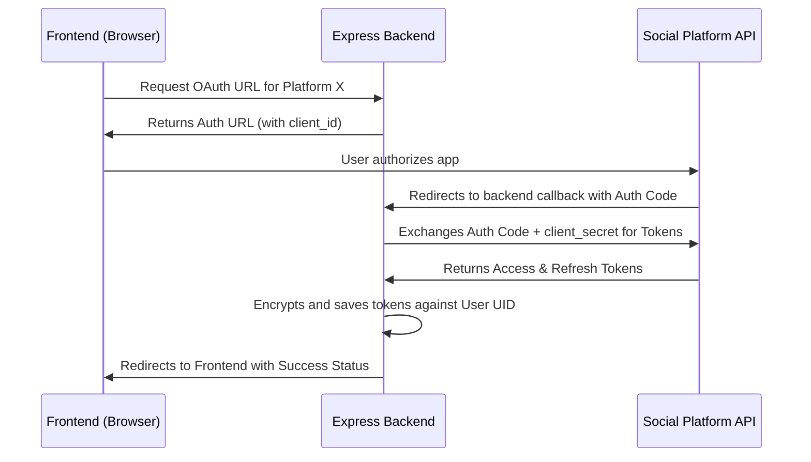
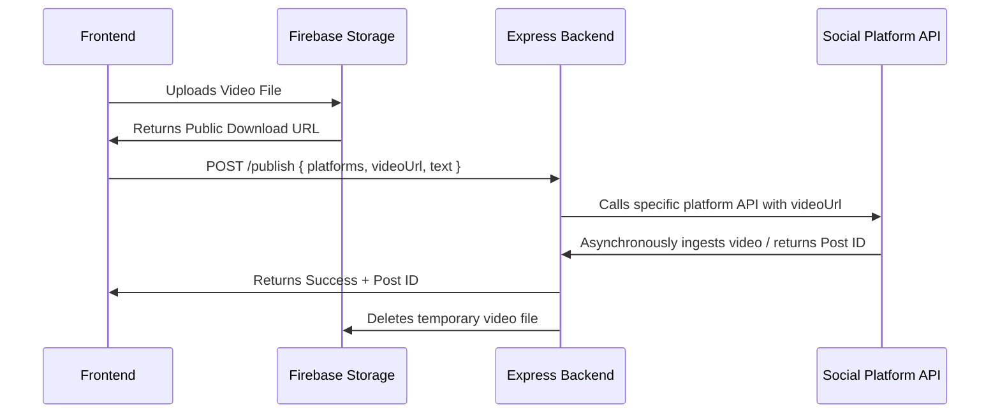

# F002 — Real Social Media API Integrations
## Business Requirements Document (BRD)

> **Feature ID:** F002
> **Status:** 🔵 In Requirements
> **Author:** BA Agent
> **Sprint:** Sprint 3
> **Parent Doc:** [MASTER.md](../MASTER.md)
> **Last Updated:** 2026-07-19

---

## 1. Overview

Currently, Viralify uses mock data to simulate platform connections and post publishing. This feature replaces those mocks with real social media API integrations for 7 major platforms: YouTube, Instagram, TikTok, Facebook, X (Twitter), Pinterest, and LinkedIn. 

This enables the core business value of Viralify: allowing content creators to securely connect their social media accounts and seamlessly publish or schedule video content across multiple platforms simultaneously from a single interface. 

Why these 7 platforms matter:
- **YouTube:** The primary long-form and short-form (Shorts) video destination.
- **Instagram:** Critical for Reels and influencer reach.
- **TikTok:** The leading short-form vertical video platform.
- **Facebook:** Massive legacy audience with strong video and page engagement.
- **X (Twitter):** Real-time engagement and news-cycle relevance.
- **Pinterest:** High-intent visual discovery and long-tail traffic for video pins.
- **LinkedIn:** B2B networking and professional content distribution.

---

## 2. Scope

### 2.1 In Scope
- OAuth 2.0 connection flows for the 7 target platforms.
- Secure token storage and management (refreshing tokens, detecting expiry).
- Platform disconnection and token revocation.
- Temporary video hosting via Firebase Storage to generate public URLs (required for YouTube, TikTok, Pinterest).
- Video upload APIs (chunked uploads, resumable uploads where supported).
- Publishing posts (titles, descriptions, hashtags, video media) to the connected platforms.
- Post status tracking (success, failed, rate-limited) and error handling.
- Node.js + Express backend to act as an OAuth proxy and securely hold `client_secret` credentials.

### 2.2 Out of Scope
- Paid analytics APIs or deep historical performance metrics.
- Algorithmic scheduling or AI best-time-to-post prediction APIs (using static rules for now).
- Integrations for Snapchat and Threads (deferred to future sprints).
- Managing comments, replies, or direct messages through Viralify.
- Account-level automated interactions (auto-like, auto-follow).

---

## 3. User Stories

### 3.1 YouTube
| ID | As a... | I want to... | So that... |
|---|---|---|---|
| US-001 | Creator | Connect my YouTube channel via OAuth | Viralify can publish videos on my behalf |
| US-002 | Creator | Upload and publish a video as a YouTube Short | I can reach mobile viewers with vertical content |

### 3.2 Instagram
| ID | As a... | I want to... | So that... |
|---|---|---|---|
| US-003 | Creator | Connect my Instagram Professional/Creator account | I can manage my Instagram presence from Viralify |
| US-004 | Creator | Publish a video as an Instagram Reel | I can engage my followers with short-form video |

### 3.3 TikTok
| ID | As a... | I want to... | So that... |
|---|---|---|---|
| US-005 | Creator | Authorize Viralify to access my TikTok account | I can bypass manual uploads on the TikTok app |
| US-006 | Creator | Publish vertical videos directly to my TikTok feed | I can capitalize on TikTok trends efficiently |

### 3.4 Facebook
| ID | As a... | I want to... | So that... |
|---|---|---|---|
| US-007 | Social Media Manager | Connect a specific Facebook Page I manage | I can post official content for my brand |
| US-008 | Social Media Manager | Upload video posts to my Facebook Page | My Page followers see new video content |

### 3.5 X (Twitter)
| ID | As a... | I want to... | So that... |
|---|---|---|---|
| US-009 | Creator | Connect my X (Twitter) account | I can share video snippets with my followers |
| US-010 | Creator | Publish media tweets with text and video | I can participate in real-time conversations |

### 3.6 Pinterest
| ID | As a... | I want to... | So that... |
|---|---|---|---|
| US-011 | Creator | Connect my Pinterest Business account | I can create video pins |
| US-012 | Creator | Select a Pinterest Board and publish a video pin | I can drive long-term traffic to my content |

### 3.7 LinkedIn
| ID | As a... | I want to... | So that... |
|---|---|---|---|
| US-013 | Professional | Connect my LinkedIn profile or company page | I can share thought leadership content |
| US-014 | Professional | Publish native video posts to my LinkedIn feed | I can engage my professional network |

---

## 4. Functional Requirements

### 4.1 Platform OAuth Connection
| ID | Requirement | Priority |
|---|---|---|
| FR-001 | System must implement YouTube (Google) OAuth 2.0 flow, requesting YouTube Data API v3 upload scopes. | Must Have |
| FR-002 | System must implement Instagram Graph API OAuth flow for Professional/Creator accounts. | Must Have |
| FR-003 | System must implement TikTok Direct Post API OAuth flow. | Must Have |
| FR-004 | System must implement Facebook Graph API OAuth flow to retrieve Page Access Tokens. | Must Have |
| FR-005 | System must implement X (Twitter) OAuth 2.0 (PKCE) flow. | Must Have |
| FR-006 | System must implement Pinterest API v5 OAuth flow. | Must Have |
| FR-007 | System must implement LinkedIn API v2 OAuth flow with `w_member_social` or equivalent scopes. | Must Have |

### 4.2 Token Management
| ID | Requirement | Priority |
|---|---|---|
| FR-008 | Node.js backend must handle all token exchanges; `client_secret` must never be exposed to the frontend. | Critical |
| FR-009 | Access tokens and refresh tokens must be stored securely (encrypted if in database, or secure HTTP-only sessions). | Critical |
| FR-010 | Backend must automatically use refresh tokens to obtain new access tokens before API calls if the current token is expired. | Must Have |
| FR-011 | If a refresh token is invalid or expired, the system must prompt the user to re-authenticate the platform. | Must Have |
| FR-012 | Users must be able to disconnect a platform, which deletes the tokens from the backend and revokes them on the platform. | Must Have |
| FR-013 | The frontend Accounts view must show real connection status based on token validity, replacing mock state. | Must Have |
| FR-014 | Backend must associate OAuth tokens with the authenticated Firebase User ID. | Must Have |

### 4.3 Media Upload Flows
| ID | Requirement | Priority |
|---|---|---|
| FR-015 | For platforms requiring public video URLs (YouTube, TikTok, Pinterest), the frontend must first upload the video to Firebase Storage. | Must Have |
| FR-016 | System must generate a temporary signed/public URL from Firebase Storage to pass to platform APIs. | Must Have |
| FR-017 | After successful API ingestion by the target platforms, the temporary video file must be deleted from Firebase Storage to save costs. | Should Have |
| FR-018 | For platforms requiring direct upload (X, Facebook, LinkedIn, Instagram), the backend must support streaming or chunked uploads from the client to the platform API. | Must Have |
| FR-019 | System must validate video MIME types (e.g., `video/mp4`, `video/quicktime`) before upload. | Must Have |
| FR-020 | System must enforce platform-specific maximum file size limits during the upload phase. | Must Have |
| FR-021 | The frontend must display an overall upload progress bar when transferring media. | Must Have |

### 4.4 Post Publishing & Status Tracking
| ID | Requirement | Priority |
|---|---|---|
| FR-022 | Backend must accept a uniform payload (video URL/buffer, title, description, platforms) and orchestrate API calls to all selected platforms. | Must Have |
| FR-023 | System must capture the platform-specific post ID returned by each API upon successful publication. | Must Have |
| FR-024 | If a post fails on one platform but succeeds on others, the system must record partial success and clearly show which platform failed with the error message. | Must Have |
| FR-025 | Published posts in the Dashboard must link directly to the live post on the respective platform using the returned post ID. | Should Have |

---

## 5. Acceptance Criteria

| ID | Criteria (Given/When/Then) | Validates |
|---|---|---|
| AC-001 | GIVEN a user wants to connect YouTube, WHEN they click Connect, THEN they are redirected to Google OAuth and return with a connected status. | FR-001 |
| AC-002 | GIVEN a user connects Instagram, WHEN they complete OAuth, THEN their Professional account is linked. | FR-002 |
| AC-003 | GIVEN a user connects TikTok, WHEN authorized, THEN Viralify receives publishing scopes. | FR-003 |
| AC-004 | GIVEN a user connects Facebook, WHEN authorized, THEN they can select which Page to connect. | FR-004 |
| AC-005 | GIVEN a user connects X, WHEN authorized via PKCE, THEN their connection is saved. | FR-005 |
| AC-006 | GIVEN a user connects Pinterest, WHEN authorized, THEN they can fetch their boards. | FR-006 |
| AC-007 | GIVEN a user connects LinkedIn, WHEN authorized, THEN their profile is ready for UGC posting. | FR-007 |
| AC-008 | GIVEN an expired access token, WHEN a publish request is made, THEN the backend transparently refreshes the token. | FR-010 |
| AC-009 | GIVEN a revoked access token, WHEN a publish request fails, THEN the UI shows a "Reconnect Required" state. | FR-011 |
| AC-010 | GIVEN a user clicks Disconnect for a platform, WHEN confirmed, THEN the tokens are deleted from the backend. | FR-012 |
| AC-011 | GIVEN a user publishes to YouTube, WHEN the flow starts, THEN the video is uploaded to Firebase Storage and a public URL is generated. | FR-015, FR-016 |
| AC-012 | GIVEN the Firebase upload completes, WHEN the API consumes the URL, THEN the video is deleted from Firebase within 24 hours. | FR-017 |
| AC-013 | GIVEN a user publishes to X, WHEN uploading, THEN the backend uses X's chunked media upload API. | FR-018 |
| AC-014 | GIVEN a user selects a `.pdf` file, WHEN uploading, THEN the system rejects it as an invalid MIME type. | FR-019 |
| AC-015 | GIVEN a 2GB file for TikTok (limit 500MB), WHEN selected, THEN the UI rejects the file before upload begins. | FR-020 |
| AC-016 | GIVEN a multi-platform post is triggered, WHEN uploading, THEN a progress bar reflects the upload status to the backend/Firebase. | FR-021 |
| AC-017 | GIVEN a user submits a post for 3 platforms, WHEN processed, THEN the backend routes the payload to all 3 APIs. | FR-022 |
| AC-018 | GIVEN a successful post to Facebook, WHEN the response is received, THEN the Facebook Post ID is stored in the database. | FR-023 |
| AC-019 | GIVEN a post succeeds on X but fails on LinkedIn due to rate limits, WHEN completed, THEN the UI shows X as Success and LinkedIn as Failed. | FR-024 |
| AC-020 | GIVEN a published post on the dashboard, WHEN the user clicks the platform icon, THEN it opens the live post in a new tab. | FR-025 |

---

## 6. Non-Functional Requirements

| ID | Requirement | Target |
|---|---|---|
| NFR-001 | **Security:** The frontend MUST NOT contain any platform API `client_secret` strings. | Strict Compliance |
| NFR-002 | **Performance:** Media uploads to Firebase/Backend must not timeout for files up to 1GB on standard broadband (allow up to 10 minutes timeout). | < 10 mins |
| NFR-003 | **Reliability:** Backend APIs must implement retry logic with exponential backoff for rate limit (HTTP 429) responses. | Max 3 retries |
| NFR-004 | **Storage Security:** OAuth tokens stored in the backend database must be encrypted at rest. | AES-256 |
| NFR-005 | **Scalability:** The Express backend must be stateless to allow horizontal scaling (no in-memory token storage). | Stateless |

---

## 7. Technical Architecture

### 7.1 Component Roles
- **Frontend (Vanilla JS):** Handles UI, Firebase Auth, Firebase Storage uploads (for public URLs), and calls the Node.js API to trigger publishing.
- **Node.js + Express Backend:** Serves as a secure proxy. Holds API Client Secrets. Executes OAuth token exchanges. Makes the actual publishing calls to social platforms.
- **Firebase Auth:** Manages user identity. Backend verifies Firebase ID tokens to authenticate requests.
- **Firebase Storage:** Acts as a temporary CDN for videos when platforms require a hosted URL (YouTube, TikTok, Pinterest).
- **Database (Firestore or Postgres):** Stores the encrypted OAuth tokens mapped to the user's Firebase UID.

### 7.2 OAuth 2.0 Flow Diagram

### 7.3 Publishing Flow Diagram

---

## 8. Platform-Specific API Details

### 8.1 YouTube (Google API v3)
- **Auth Endpoint:** `https://accounts.google.com/o/oauth2/v2/auth`
- **Scopes:** `https://www.googleapis.com/auth/youtube.upload`
- **Upload Endpoint:** `POST https://www.googleapis.com/upload/youtube/v3/videos?part=snippet,status`
- **Method:** Resumable upload or direct upload with Firebase URL.
- **Constraints:** Max 256GB / 12 hours. Shorts must be <60s and vertical.
- **Dev Requirements:** Google Cloud Console project, YouTube Data API v3 enabled.

### 8.2 Instagram (Graph API)
- **Auth Endpoint:** `https://www.facebook.com/v17.0/dialog/oauth`
- **Scopes:** `instagram_basic, instagram_content_publish, pages_read_engagement`
- **Upload Endpoint:** Container creation via `POST /{ig-user-id}/media`, then `POST /{ig-user-id}/media_publish`
- **Method:** Requires public video URL (Firebase).
- **Constraints:** Max 1GB, 60 minutes for Reels. Aspect ratio 9:16.
- **Dev Requirements:** Meta App with Instagram Graph API enabled, Advanced Access required for public use.

### 8.3 TikTok (Direct Post API)
- **Auth Endpoint:** `https://www.tiktok.com/v2/auth/authorize/`
- **Scopes:** `video.upload`
- **Upload Endpoint:** `POST https://open.tiktokapis.com/v2/post/publish/video/init/` (Init, Upload, Complete flow)
- **Method:** Chunked direct upload or Pull-from-URL.
- **Constraints:** Max 500MB, 10 minutes. Titles max 150 chars.
- **Dev Requirements:** TikTok for Developers App, approved for Direct Post API.

### 8.4 Facebook (Graph API)
- **Auth Endpoint:** `https://www.facebook.com/v17.0/dialog/oauth`
- **Scopes:** `pages_manage_posts, pages_read_engagement`
- **Upload Endpoint:** `POST /{page-id}/videos`
- **Method:** Chunked upload or direct with URL.
- **Constraints:** Max 10GB, 240 minutes.
- **Dev Requirements:** Meta App with Page publishing permissions.

### 8.5 X (Twitter) (API v2)
- **Auth Endpoint:** `https://twitter.com/i/oauth2/authorize`
- **Scopes:** `tweet.read, tweet.write, offline.access`
- **Upload Endpoint:** `POST https://upload.twitter.com/1.1/media/upload.json` (INIT, APPEND, FINALIZE)
- **Method:** Chunked direct upload required.
- **Constraints:** Max 512MB, 2m 20s. Tweet text 280 chars.
- **Dev Requirements:** Twitter Developer Portal App with elevated access.

### 8.6 Pinterest (API v5)
- **Auth Endpoint:** `https://www.pinterest.com/oauth/`
- **Scopes:** `boards:read, pins:write`
- **Upload Endpoint:** `POST https://api.pinterest.com/v5/media`
- **Method:** Register media, then upload, then create Pin.
- **Constraints:** Max 2GB, 15 minutes.
- **Dev Requirements:** Pinterest Developer App.

### 8.7 LinkedIn (API v2)
- **Auth Endpoint:** `https://www.linkedin.com/oauth/v2/authorization`
- **Scopes:** `w_member_social, r_liteprofile`
- **Upload Endpoint:** `POST https://api.linkedin.com/v2/assets?action=registerUpload`
- **Method:** Register, Upload (PUT), Create `ugcPost`.
- **Constraints:** Max 5GB, 10 minutes.
- **Dev Requirements:** LinkedIn Developer App with Share on LinkedIn product added.

---

## 9. Open Questions

| # | Question | Owner | Status | Decision |
|---|---|---|---|---|
| OQ-1 | Which database will the Node.js backend use to store the encrypted OAuth tokens? | User | Open | TBD (Firestore recommended since Firebase Auth is used) |
| OQ-2 | For platforms requiring chunked upload (X, TikTok), will the frontend send chunks to the backend, or will the backend download from Firebase Storage and chunk it to the API? | User | Open | TBD (Backend downloading from Firebase is more reliable) |
| OQ-3 | Will we implement polling or webhooks for platforms that process videos asynchronously (e.g., YouTube, Instagram)? | User | Open | TBD |

---

## 10. Dependencies

| Dependency | Type | Notes |
|---|---|---|
| `express` | npm | Web server for proxy |
| `cors` | npm | Cross-origin handling |
| `axios` | npm | Outbound API requests |
| `firebase-admin` | npm | Verifying frontend Auth tokens & Storage access |
| `multer` | npm | Handling multipart/form-data for direct uploads |
| `dotenv` | npm | Environment variable management |
| Developer Accounts | External | Approved apps for all 7 platforms |

---

## 11. Definition of Done
- Node.js backend deployed and securely managing OAuth flows.
- Tokens encrypted and safely stored.
- All 7 platforms can be successfully connected and disconnected from the frontend.
- A user can select a video, add a title/description, and successfully publish it to all 7 platforms simultaneously.
- Temporary Firebase Storage videos are reliably deleted post-publish.
- Documentation updated and APIs cataloged.

---

## 12. Risks & Mitigations

| Risk | Impact | Mitigation |
|---|---|---|
| API Deprecation / Policy Changes | High | Abstract platform logic into isolated service classes in the backend. Monitor developer changelogs. |
| Rate Limiting | Medium | Implement queueing and exponential backoff in the Node.js backend for high-volume users. |
| Large Video Upload Failures | High | Use Firebase Storage for reliable client-side resumable uploads, then backend pulls from Firebase. |
| Token Expiry / Revocation | Medium | Implement robust refresh logic and clear UI indicators for users to reconnect accounts. |

---

## 13. BA Review Checklist

> Completed by: BA Agent | Date: 2026-07-19

- [ ] All user stories have clear acceptance criteria
- [ ] Functional requirements are complete and unambiguous
- [ ] Non-functional requirements are measurable
- [ ] UI/UX requirements match existing design system
- [ ] Technical approach is feasible within current stack
- [ ] All dependencies identified
- [ ] All risks documented with mitigations
- [ ] Open questions flagged for stakeholder input
- [ ] No conflicting requirements detected
- [ ] Feature is achievable within Sprint 3 scope
